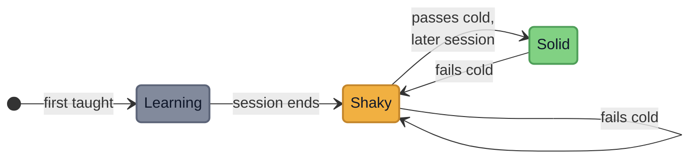
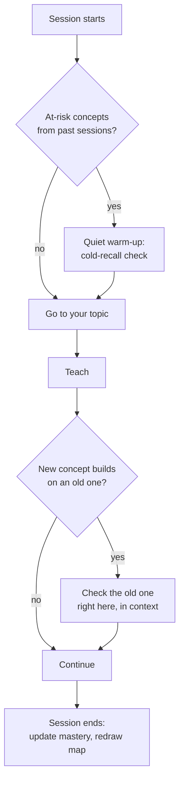

<p align="center">
  
</p>

<h1 align="center">/learn-code</h1>

<p align="center">
  <em>A tutor skill for Claude Code that refuses to do your homework, and makes the concept stick.</em>
</p>

<p align="center">
  
  
  
</p>

---

## Why this exists

Ask an AI to explain a concept and it explains beautifully. You nod. You move
on. A week later, nothing stuck.

The problem isn't the explanation, it's that reading an answer feels like
learning without being learning. What consolidates a concept is **retrieving it
from a cold start** and **explaining it in your own words**, not recognizing it
when it's shown to you.

`/learn-code` is built around that. It never hands you a working solution to
your own problem. It breaks the problem down, teaches the building blocks, and
guides you until the answer becomes so obvious you don't need it anymore. Then
it tracks, quietly, whether the concept actually survived over time, and brings
it back when something new is built on top of it.

The goal is not today's answer. It's the day you no longer need the tutor.

## What it does

Four ways to work, picked automatically from what you ask:

| Mode | When | What happens |
|------|------|--------------|
| **Overview** | "how do I use lists" | The handful of operations you actually need, each a runnable example, ordered by real frequency. Never a catalog. |
| **Deep-dive** | "go deep on `.sort()`" | One command, its real alternatives, when to reach for which, the edge cases that bite. |
| **Exercise** | you paste a problem | Decomposed into steps. You write the code; worked examples only ever use *different* data. Stuck? It changes angle, never gives the solution. |
| **Quiz** | you don't get it | A closed question (predict the output, spot the bug, true/false). Wrong? A targeted nudge, then the same question again, until it clicks. |

Covers Python, SQL, Linux, Git, ML/DL, Excel, Tableau, JavaScript, C/C++, data
science, and the supporting math, statistics and logic.

## How the memory works

Recognition doesn't consolidate; cold recall does. So a concept only turns
**green** when you recall it correctly, from scratch, in a *later* session than
the one you learned it in. Fail it later and it honestly drops back.



| State | Meaning | Counts toward mastery |
|-------|---------|-----------------------|
| **Learning** | taught in the current session, not yet tested from cold | 0 |
| **Shaky** | survived the session, still unproven on its own | 0.5 |
| **Solid** | recalled cold and unaided, in a session after the one that taught it | 1 |

Two rules carry the whole design. A check passed in the same session you were
taught earns nothing, because that is recognition, and recognition fades. And a
session must end before a concept can ever go green, so *later* is enforced by
the shape of the data rather than by a date comparison you could satisfy by
waiting.

Review is silent and contextual. No random pop-ups. When a new concept builds on
an older one, the old one gets checked right there. A short warm-up at the start
of a session revisits what's most at risk. Progress lives in a small local
SQLite database, and you can see it as a growth map:

```
Python
  comprehensions ████████████░░░░░░░░ 60%
  dictionaries   ██████████████░░░░░░ 70%
SQL
  joins          ██████████░░░░░░░░░░ 50%
```

Your learning data is yours. It stays in `~/.claude/learn-code/`, never in this
repository, never uploaded.

<details>
<summary><strong>The silent review loop</strong></summary>



No calendars, no random pop-ups. Old concepts resurface exactly when something
new leans on them, or as a brief warm-up when they're most at risk of fading.
</details>

## Install

```bash
git clone https://github.com/cristian-galeazzi/learn-code-skill.git
mkdir -p ~/.claude/skills
ln -s "$PWD/learn-code-skill/skills/learn-code" ~/.claude/skills/learn-code
```

Then in Claude Code:

```
/learn-code dictionaries in python
```

That's it. The tracking database is created on first use.

## Requirements

- Claude Code
- Python 3.9+ (standard library only, no runtime dependencies)
- `sqlite3` (bundled with Python)

### Recommended companion

The tutor checks library and stdlib behavior against live documentation instead
of trusting its training data. That lookup runs through
[Context7](https://github.com/upstash/context7), a separate MCP server by
Upstash. `/learn-code` works without it, but with it the examples about
fast-moving libraries (pandas, scikit-learn, and friends) stop drifting out of
date:

```bash
npx ctx7 setup
```

A free API key raises the rate limits, and their setup command generates one for
you. Their own disclaimer is worth repeating: Context7 documentation is
community contributed, so treat what it returns as a strong hint, not gospel.

## Development

Tests use `pytest` in an isolated virtual environment:

```bash
python3 -m venv .venv
.venv/bin/pip install -r requirements-dev.txt
.venv/bin/python -m pytest tests/ -q
.venv/bin/python -m doctest skills/learn-code/learn_code_db.py
```

## License

MIT. See [LICENSE](LICENSE).

### Credits

- [Context7](https://github.com/upstash/context7) is an independent project by
  Upstash, Inc., MIT licensed, and is neither affiliated with nor endorsing this
  repository. It is not bundled here: `/learn-code` calls it only if you have
  installed it yourself.
- Artwork generated with Google Gemini.
