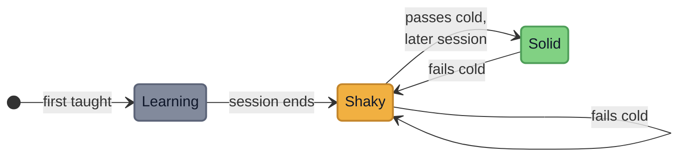
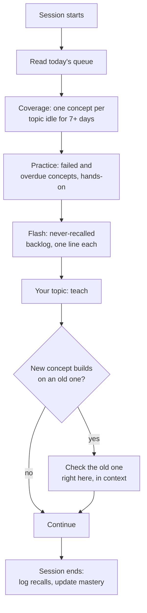

<p align="center">
  
</p>

<h1 align="center">/learn-code</h1>

<p align="center">
  <strong>Learned it with AI, forgot it a week later?</strong><br>
  <em>A tutor skill for Claude Code that refuses to do your homework, and makes the concept stick.</em>
</p>

<p align="center">
  <a href="https://github.com/cristian-galeazzi/learn-code-skill/actions/workflows/tests.yml"></a>
  
  
  
</p>

---

## Why this exists

Ask an AI to explain a concept and it explains beautifully. You nod. You move
on. A week later, nothing stuck.

The problem isn't the explanation, it's that reading an answer feels like
learning without being learning. What consolidates a concept is **retrieving it
from a cold start** and **explaining it in your own words**, not recognizing it
when it's shown to you.

`/learn-code` is built around that. It never hands you a working solution to
your own problem. It breaks the problem down, teaches the building blocks, and
guides you until the answer becomes so obvious you don't need it anymore. Then
it tracks, quietly, whether the concept actually survived over time, and brings
it back when something new is built on top of it.

The goal is not today's answer. It's the day you no longer need the tutor.

## What it does

Four ways to work, picked automatically from what you ask:

| Mode | When | What happens |
|------|------|--------------|
| **Overview** | "how do I use lists" | The handful of operations you actually need, each a runnable example, ordered by real frequency. Never a catalog. |
| **Deep-dive** | "go deep on `.sort()`" | One command, its real alternatives, when to reach for which, the edge cases that bite. |
| **Exercise** | you paste a problem | Decomposed into steps. You write the code; worked examples only ever use *different* data. Stuck? It changes angle, never gives the solution. |
| **Hands-on review** | a review session | Old concepts come back as small tasks you actually run (a script, a git operation, a shell command), not as questions you answer by recognition. |

Every explanation goes deep by default: university level, every step of a
reasoning written out, every new term defined from what you already know, with
visuals and analogies. Depth means complete steps on **one** concept at a time
(at most 4-5 new terms per answer), and prose stays under 25 lines per turn, so
a long explanation is split across turns instead of arriving as a wall.

Covers Python, SQL, Linux, Git, ML/DL, Excel, Tableau, JavaScript, C/C++, data
science, and the supporting math, statistics and logic. The teaching layer is
tuned for code (runnable examples, hands-on review), but the memory engine
underneath is subject-agnostic: a concept with no runnable form is reviewed by
free-text recall instead.

## The teaching loop

Overviews and deep-dives draw the map. What actually teaches is this cycle, run
on every concept that needs real understanding, one at a time:

| # | Stage | What happens |
|---|-------|--------------|
| 1 | Prerequisites | Anything the concept needs that you don't own yet is taught first |
| 2 | Teach one concept | A thesis, a few bullets, one runnable example |
| 3 | Test it | A closed question on that concept, right away |
| 4 | Verify it landed | You restate it in your own words, or predict the output of a new snippet. Passing a closed question is not proof |
| 5 | Advance | Next concept, back to stage 2 |
| 6 | Re-test later | Never the same day: the first cold re-test comes in a review two days later |
| 7 | Save | What was taught and what was verified goes into the local database |
| 8 | Raise the level | Once a topic has been stable for a while, sessions open with a harder, integrating problem on it |

Your own question always comes first: the loop waits until it is answered.

## How the memory works

Recognition doesn't consolidate; cold recall does. So a concept only turns
**green** when you recall it correctly, from scratch, in a *later* session than
the one you learned it in. Fail it later and it honestly drops back.



| State | Meaning | Counts toward mastery |
|-------|---------|-----------------------|
| **Learning** | taught in the current session, not yet tested from cold | 0 |
| **Shaky** | survived the session, still unproven on its own | 0.5 |
| **Solid** | recalled cold and unaided, in a later session than the one that taught it | 1 |

Two rules carry the whole design. A check passed in the same session you were
taught earns nothing, because that is recognition, and recognition fades. And a
session must end before a concept can ever go green, so *later* is enforced by
the shape of the data rather than by a date comparison you could satisfy by
waiting.

### Spaced recall

Solid is not forever. A solid concept rests, then comes back for another cold
check, and every success lengthens the next rest:

| Net successes (passes minus fails) | Comes back after |
|---|---|
| 1 | 7 days |
| 2 | 21 days |
| 3 | 63 days |
| 4 | 189 days |

A failed recall drops the concept back to shaky and retests it from the next
day. A recall that needed a hint counts as a fail for scheduling, but is logged
apart, so "forgot it" and "almost had it" stay distinguishable. There is no cap
on the rest interval on purpose: a capped interval would bring every concept
back forever, and the daily load would grow with everything you ever learned.

### The daily review queue

At the start of a session the tutor reads one ordered queue from the database:

| Priority | Lane | What it holds |
|---|---|---|
| 1 | **Coverage** | One concept from every topic that has had no cold recall in 7 days. Never skipped: no studied topic may sit untouched for weeks |
| 2 | **Practice** | Failed concepts due again, then solid concepts whose rest ran out, most overdue first. Up to 10, at most 3 per area, run as hands-on tasks |
| 3 | **Flash** | Concepts never recalled yet, oldest first, as one-line questions. Only concepts at least two days old: a check minutes after the lesson measures working memory, not learning |

The size of the day's queue is computed, not guessed: the concepts introduced in
your last session, plus a seventh of the never-recalled backlog. Old material
drains faster than new material arrives, so the backlog shrinks instead of
piling up. A longer, review-only session can ask for any size.

Review also stays contextual: when a new concept builds on an older one, the old
one gets checked right there. Progress lives in a small local SQLite database,
and you can see it as a growth map:

```
Python
  comprehensions ████████████░░░░░░░░ 60%
  dictionaries   ██████████████░░░░░░ 70%
SQL
  joins          ██████████░░░░░░░░░░ 50%
```

Your learning data is yours. Progress, plan and recall history stay in
`~/.claude/learn-code/`, your files in `~/learn-code/sources/`: never in this
repository, never uploaded. Every recall is logged with its date and outcome,
so a `report` can tell you how well memory holds at 1-3, 4-10, 11-30 and 30+
days, which is how you find out whether the schedule fits you.

### Your sources

The tutor does not replace your material, it works on top of it. Learn from
whatever you choose: official documentation, a course, your own notes, a
chapter of a textbook. Each concept records where it came from, and review
reopens that material for practice instead of improvising new content, so what
you rehearse is what you actually studied. When a unit is finished (a chapter,
a lesson, a docs section), its key concepts go into the database, including the
ones you studied on your own.

### Fading support

Help is not constant. Every topic carries a scaffolding level computed from the
tracking DB, from 3 (full micro-steps and hints) down to 0 (problem statement
and a review afterwards). It falls as concepts go solid and survive cold recall,
which is the whole point: the skill is trying to make itself unnecessary.

It never falls against your will. Ask for more help and the level is pinned
where you want it until you say otherwise.

### Bridges

The brain keeps what it can attach to something it already holds. When two
concepts from different areas turn out to be the same mechanism, SQL `GROUP BY`
and pandas `groupby` for instance, the link is recorded and reused: the next
time either side comes up, the lesson starts from what you already know. Your
growth map shows the bridges, so the knowledge reads as one network instead of
separate boxes.

### Arcs

A study block can have a governing idea: one sentence the block is chasing,
stated as a claim only after a concrete example has made it true, then repeated
as the spine. The tutor tracks open arcs, and a closed arc's thesis comes back
later as a cold-recall question of its own. A block with no governing idea is
fine, and the tutor says so instead of inventing a slogan.

<details>
<summary><strong>The review loop</strong></summary>



No random pop-ups. Old concepts come back on a schedule that stretches as they
hold, every topic gets touched at least once a week, and anything new that leans
on an old concept checks it on the spot.
</details>

### Hands-on workspace

Hands-on review needs real, accumulating state, so it runs in a git repository
at `~/learn-code-practice/`: git tasks work against its actual history, shell
and Python tasks go in its `scratch/` folder. You create it yourself on your
first hands-on review (three commands, and real git practice in itself). The
tutor never runs commands there for you.

## Install

**As a plugin (recommended).** In Claude Code:

```
/plugin marketplace add cristian-galeazzi/learn-code-skill
/plugin install learn-code@learn-code-skill
```

Then start learning:

```
/learn-code:learn-code dictionaries in python
```

Plugin skills carry the plugin name as a prefix, hence the double name. You can
also just ask a learning question: the skill triggers on its own.

**Manually, as a standalone skill.** Useful if you want to hack on it:

```bash
git clone https://github.com/cristian-galeazzi/learn-code-skill.git
mkdir -p ~/.claude/skills
ln -s "$PWD/learn-code-skill/skills/learn-code" ~/.claude/skills/learn-code
```

Then `/learn-code dictionaries in python`. Use one install or the other, not
both, or the skill shows up twice.

Either way, the tracking database is created on first use.

## First run

The first time you call it, the tutor asks seven short questions, most of them
one click, and every one skippable:

1. the language it should answer in;
2. the topics you want to learn now;
3. your level in each;
4. what it is for (work, an exam, a project, curiosity) and whether there is a date;
5. how much time you have per day and per week, and, if your session has
   calendar or reminder tools, whether to put study blocks and review reminders
   there (shown to you before anything is created);
6. where you run code (notebooks, VS Code, a terminal, or not set up yet);
7. your sources: drop your own files in `~/learn-code/sources/`, add them later,
   or ask for suggestions (free, legal, links checked).

It turns the answers into a small plan, shows it to you, and starts the first
lesson. Say "just teach me" at any point to skip the whole thing. The plan stays
on your machine in `~/.claude/learn-code/plan.md`, and you change it by simply
telling the tutor.

## Commands

The tutor drives the tracking CLI for you, so you never need it. To look at your
progress yourself, ask Claude (for example "show my learn-code growth map"), or
run the script that sits next to `SKILL.md`:

```bash
python3 <skill directory>/learn_code_db.py bars
```

| Command | Purpose |
|---------|---------|
| `bars` | Growth map: mastery per topic, grouped by area |
| `report [--days N]` | Recall outcomes by gap since the previous recall and by area, plus topics coverage is forcing in (default: --days 28) |
| `brief [--topic TOPIC_ID] [--limit N] [--quota N]` | Everything the tutor reads before teaching: today's review queue (coverage, practice, flash) with its balance line, support levels, misconceptions, bridges for queued concepts, challenge-ready topics (defaults: --limit 10, quota computed) |
| `support-level TOPIC_ID` | Current scaffolding level for a topic, 0 (autonomous) to 3 (full support) |
| `support-floor TOPIC_ID 0\|1\|2\|3\|clear` | Pin a minimum support level, the guarantee that help is never taken away against the learner's will |
| `link A_CONCEPT B_CONCEPT "why"` | Record a bridge between two concepts in different areas |
| `links CONCEPT_ID` | Show every bridge touching a concept |
| `challenge [--days N] [--min-solid N]` | Topics stable long enough to deserve a complex integrating problem (defaults: --days 10, --min-solid 2) |
| `arc-current [--topic TOPIC_ID]` | Open arcs and their theses |

The full list is in `--help`.

## Requirements

- Claude Code
- Python 3.9+ (standard library only, no runtime dependencies)
- `sqlite3` (bundled with Python)

### Recommended companion

The tutor checks library and stdlib behavior against live documentation instead
of trusting its training data. That lookup runs through
[Context7](https://github.com/upstash/context7), a separate MCP server by
Upstash. `/learn-code` works without it, but with it the examples about
fast-moving libraries (pandas, scikit-learn, and friends) stop drifting out of
date:

```bash
npx ctx7 setup
```

A free API key raises the rate limits, and their setup command generates one for
you. Their own disclaimer is worth repeating: Context7 documentation is
community contributed, so treat what it returns as a strong hint, not gospel.

## Development

Tests use `pytest` in an isolated virtual environment:

```bash
python3 -m venv .venv
.venv/bin/pip install -r requirements-dev.txt
.venv/bin/python -m pytest tests/ -q
.venv/bin/python -m doctest skills/learn-code/learn_code_db.py
```

The same checks run in CI on Python 3.9 and 3.13. To check the plugin packaging:

```bash
claude plugin validate .
```

## License

MIT. See [LICENSE](LICENSE).

### Credits

- [Context7](https://github.com/upstash/context7) is an independent project by
  Upstash, Inc., MIT licensed, and is neither affiliated with nor endorsing this
  repository. It is not bundled here: `/learn-code` calls it only if you have
  installed it yourself.
- Artwork generated with Google Gemini.
